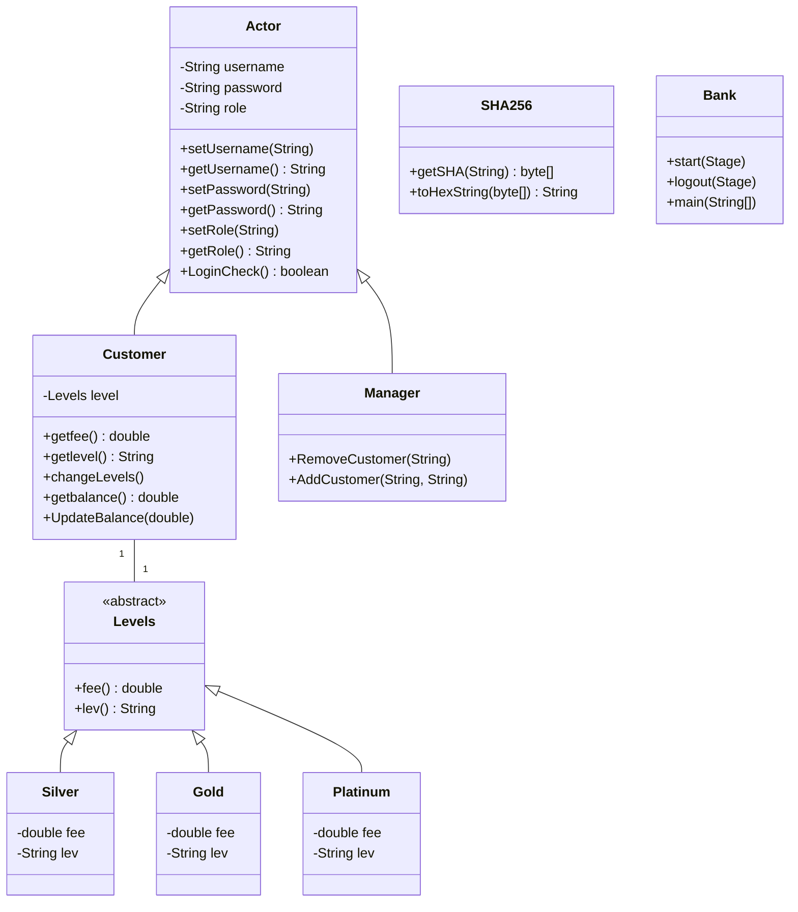

# Bank Management Application 
## Overview
This Java-based project is a bank management system. It consists of several classes representing various aspects of the banking system, including actors (customers and managers), account levels, and user interface components. The project primarily focuses on user authentication, customer management, and basic banking operations. The project integrates with an SQLite database to store customer and manager information. It retrieves and updates data from this database as needed for authentication and customer management. SHA256 is used for password hashing to ensure security. The transaction fee for each user is determined based on their account level and is implemented using the state design pattern.

## Project Functionality

- Users can log in as either customers or managers.
- Customers can view their account balance and account level (Silver, Gold, Platinum).
- Customers can withdraw and deposit funds, with their account level determining transaction fees(state design pattern).
- Managers can add and remove customers from the system.
- User authentication is performed securely using SHA-256 password hashing.
- The project utilizes JavaFX for a user-friendly graphical interface.

## Video Demo
https://www.youtube.com/watch?v=S8i-CzOfWQo

## System Architecture

The application follows a layered architecture with the following components:

1. Presentation Layer: JavaFX-based user interfaces
2. Business Logic Layer: Core banking operations and user management
3. Data Access Layer: SQLite database integration
4. Security Layer: Password hashing using SHA-256

## Class Diagram

## Key Components

### 1 Actor Class
- Base class for all users (customers and managers)
- Contains common attributes: username, password, role
- Provides basic authentication method (LoginCheck)

### 2 Customer Class
- Extends Actor class
- Manages customer-specific operations: balance checking, withdrawals, deposits
- Implements account level management (Silver, Gold, Platinum)

### 3 Manager Class
- Extends Actor class
- Handles manager-specific operations: adding and removing customers

### 4.4 Levels Classes (Silver, Gold, Platinum)
- Implement the State pattern for managing different account levels
- Each level has its own fee structure

### 5 SHA256 Class
- Utility class for password hashing
- Implements SHA-256 algorithm for secure password storage

### 6 Bank Class
- Entry point of the application
- Manages the main application window and logout functionality

### 7 Controller Classes
- LoginController: Manages user authentication
- Customer_WindowController: Handles customer interface and operations
- Manager_WindowController: Manages manager interface and operations

## Database Schema

The application uses an SQLite database with two main tables:

1. CUSTR (Customers):
   - CId (Customer ID)
   - CPass (Hashed Password)
   - Balance
   - Role

2. MANGR (Managers):
   - MId (Manager ID)
   - MPass (Password)

## Key Design Patterns

### State Pattern
The application uses the State pattern to manage different account levels (Silver, Gold, Platinum). This allows for easy modification of account behavior based on the customer's balance.

